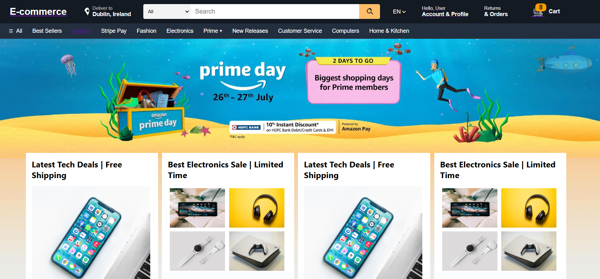
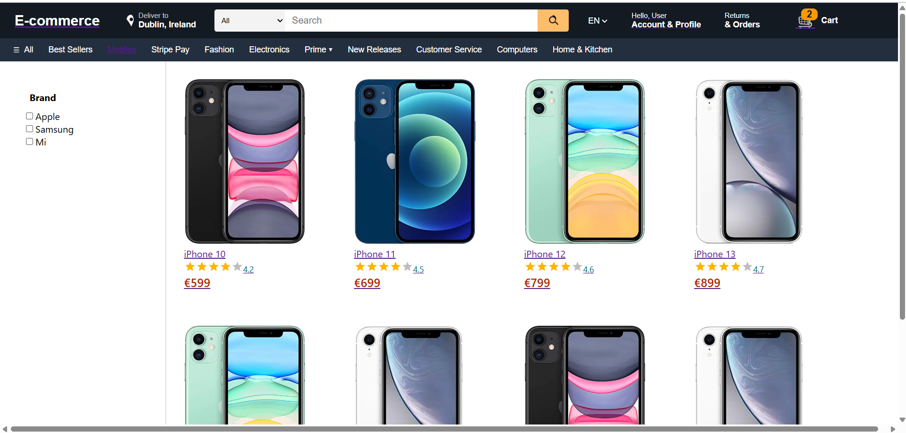
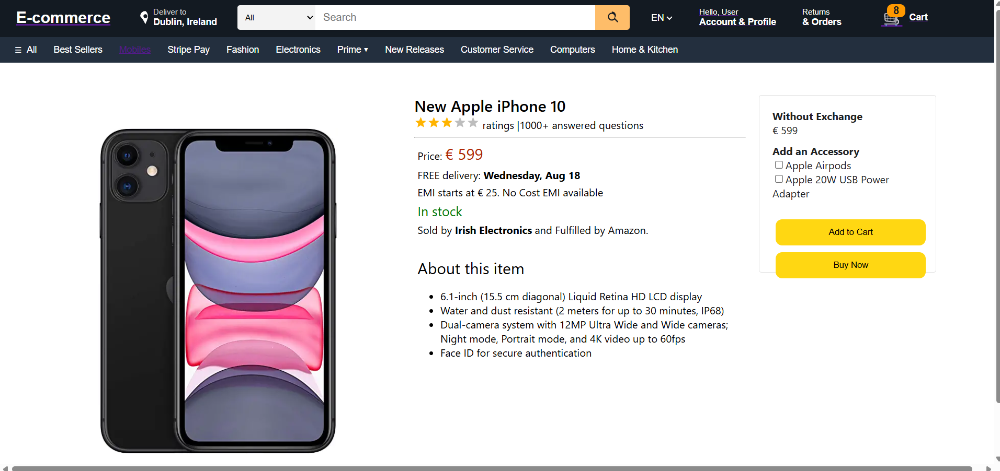

# Full-Stack E-commerce Platform

A modern, scalable e-commerce platform built with React frontend and Spring Boot microservices architecture, featuring Docker containerization and automated deployment pipeline with real-time shopping cart management.

---

## Preview

<p align="center">
  
  
</p>

<p align="center">
  
  
</p>

*Modern, responsive e-commerce interface with automated deployment pipeline*

---

## Features
- Developed a containerized Spring Boot microservices system with Product, Cart, and User services, supporting independent deployment and scaling  
- Built a modern React SPA frontend with Material-UI, React Router, and Context API for real-time cart updates and product browsing  
- Integrated PostgreSQL (cart & user data) and MongoDB (product catalog) with Spring Data JPA and MongoDB document storage  
- Implemented comprehensive unit and integration testing using JUnit, Mockito, Jest, and React Testing Library  
- Automated deployment pipeline with Docker containerization, frontend deployed to Vercel, backend to Render, and database on Railway  

---

## Tech Stack
**Frontend:**  
- React 18 (Hooks, Context API)  
- Material-UI, React Router  
- Axios for API communication  
- Jest & React Testing Library  

**Backend:**  
- Spring Boot 3.x (Java 21)  
- Spring Data JPA & MongoDB  
- RESTful API design  
- JUnit & Mockito for testing  

**Database:**  
- PostgreSQL 17 (Cart & User services)  
- MongoDB 7 (Product catalog)  

**DevOps & Deployment:**  
- Docker & Docker Compose  
- Frontend: Vercel deployment  
- Backend: Automated Docker image build & deployment to Render  
- Database: Render (PostgreSQL & MongoDB)  
- Automated CI/CD pipeline  

---

## Project Structure
```
e-commerce-platform/
├── backend/                    # Spring Boot Microservices
│   ├── productdetailsservice/  # Product Service (MongoDB)
│   ├── addToCart/             # Cart Service (PostgreSQL)  
│   ├── usermetadata/          # User Service (PostgreSQL)
│   └── docker-compose.yml    # Backend Services Setup
├── frontend/                  # React Frontend App
│   ├── src/Components/        # React Components
│   ├── src/services/         # API Services
│   └── package.json          # Dependencies
├── screenshots/              # App Screenshots
└── README.md                # Documentation
```


---

## Getting Started

### One-click Startup (Recommended)

**Prerequisites:** Docker Desktop must be installed and running

The easiest way to start the entire platform is using the one-click startup script:

```powershell
# 1. Clone the repository
git clone https://github.com/YourUsername/e-commerce-platform.git
cd e-commerce-platform

# 2. One-click startup (Recommended)
.\start-all.bat
```

This script will:
- Build and start all backend services with Docker Compose
- Initialize databases with sample data
- Start the React frontend locally
- Provide all access URLs and management commands

### Local Setup (Alternative)

```bash
# 1. Clone the repository
git clone https://github.com/YourUsername/e-commerce-platform.git
cd e-commerce-platform

# 2. Start backend services with Docker Compose
cd backend
docker-compose up --build -d

# 3. Start frontend separately
cd ../frontend
npm install
npm start

# 4. Access the application
# Frontend: http://localhost:3000
# Product API: http://localhost:8082/ecommerce/products/getALlProducts  
# Cart API: http://localhost:8081/ecommerce/addToCart
# User API: http://localhost:8083/ecommerce/user
```

---

## Contributions

This full-stack e-commerce platform project demonstrates the following skills:

- Microservices Architecture with Spring Boot and RESTful APIs
- Modern Frontend Development with React Hooks, Context API, and Material-UI
- Database Integration with PostgreSQL transactional processing and MongoDB document storage
- Test-Driven Development using JUnit, Mockito, Jest, and React Testing Library
- Containerization & Deployment with Docker, automated deployment to Vercel (frontend), Render (backend), and Render (database)

---

## Status Update

**Database Migration Completed:** Migrated from MySQL to PostgreSQL.

**Production Launch:** This e-commerce platform is currently in final testing phase and will be going live soon. Stay tuned for the official launch with full production deployment and enhanced features.

---

## License

MIT License – feel free to use and modify for learning purposes.